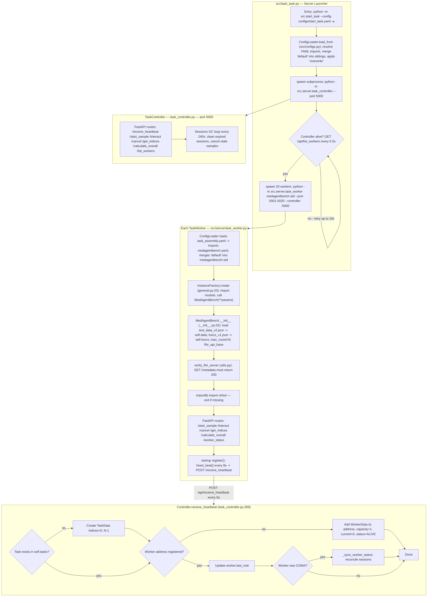
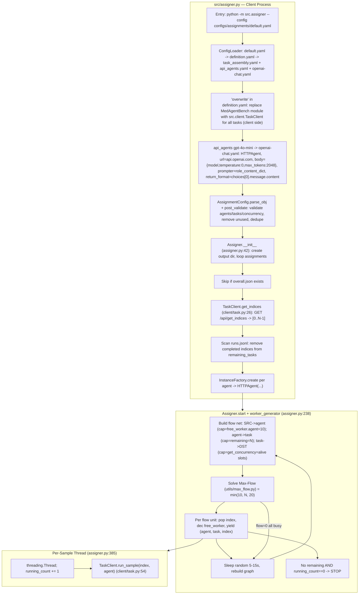
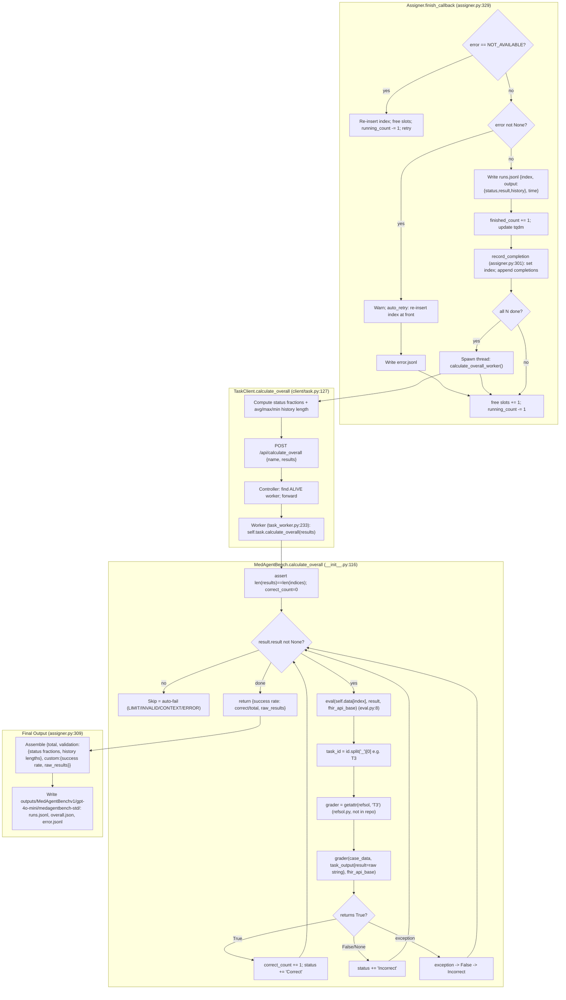

# MedAgentBench — End-to-End Architecture Flowchart

This document traces a single task through the entire MedAgentBench system, from launch to final score.

> **Viewing tip:** The diagrams below are [Mermaid](https://mermaid.live). They render automatically on GitHub, in VS Code (with a Mermaid extension), or by pasting any block into <https://mermaid.live>.

---

## Diagram 1 — System Startup

---

## Diagram 2 — Client Startup & Scheduling

---

## Diagram 3 — Per-Sample Execution & Interaction Loop

```mermaid
flowchart TD
    subgraph RS["TaskClient.run_sample (client/task.py:54)"]
        R1["POST /api/start_sample {name, index:42}"]
    end

    subgraph CTRL_SS["Controller.start_sample (task_controller.py:295)"]
        CS1["Acquire tasks_lock; verify task + index"]
        CS2["Pick ALIVE worker max(capacity-current); current += 1"]
        CS3["Create SessionData session_id=7"]
        CS4["Forward: POST worker /api/start_sample {index:42, session_id:7}"]
        CS1 --> CS2 --> CS3 --> CS4
    end

    subgraph WKR_SS["Worker.start_sample (task_worker.py:127)"]
        WS1["session_lock; check not dup; len(session_map) < concurrency(1)"]
        WS2["Create Session(): history=[]; SessionController locks+semaphores(0)"]
        WS3["asyncio task: task_start_sample_wrapper(42, session, 7); store session_map[7]"]
        WS4["await agent_pull() -> BLOCKS"]
        WS1 --> WS2 --> WS3 --> WS4
    end

    subgraph MAB["MedAgentBench.start_sample (__init__.py:57)"]
        M1["case = self.data[42] {id:T3_042, context, instruction, answer}"]
        M2["Build prompt: api_base + json.dumps(funcs 10 FHIR defs) + context + question"]
        M3["session.inject(user, prompt) -> history len 1"]
        M4["await session.action() (task.py:143)"]
        M5["filter_messages (task.py:112): odd len; _calc_segments; threshold 3500; truncate old + NOTICE"]
        M6["env_pull (task.py:34): set env_output.history; release agent_signal; await env_signal BLOCKS"]
        M1 --> M2 --> M3 --> M4 --> M5 --> M6
    end

    subgraph WKR_RESP["First response back"]
        WR1["agent_pull returns TaskOutput(RUNNING, history)"]
        WR2["Worker->Controller {session_id:7, output:{running, history}}"]
        WR3["Controller: status==RUNNING, no finish, return to client"]
        WR1 --> WR2 --> WR3
    end

    subgraph LOOP["TaskClient Loop (client/task.py:73)"]
        L1{"status == RUNNING?"}
        L2["HTTPAgent.inference(history) (http_agent.py:188)"]
        L4["role_content_dict: agent->assistant; {messages:[...]}"]
        L5["body.update(messages)"]
        L6["POST api.openai.com/v1/chat/completions; timeout 120; 3 retries"]
        L7{"status 200?"}
        L8["check_context_limit -> AgentContextLimitException"]
        L9["return_format -> choices[0].message.content (raw string)"]
        L10["AgentOutput(content=raw, status=NORMAL)"]
        L11["POST /interact {session_id:7, agent_response}"]
        L14["Exit loop -> TaskClientOutput(output)"]
        L1 -->|yes| L2 --> L4 --> L5 --> L6 --> L7
        L7 -->|yes| L9 --> L10 --> L11
        L7 -->|no| L8
        L1 -->|no| L14
    end

    subgraph CTRL_INT["Controller.interact (task_controller.py:358)"]
        CI1["Find session 7; forward POST worker /api/interact"]
        CI2["status != RUNNING -> _finish_session(7): del session, worker.current -= 1"]
        CI1 --> CI2
    end

    subgraph WKR_INT["Worker.interact (task_worker.py:159)"]
        WI1["agent_pull(AgentOutput) (task.py:22): store env_input; release env_signal; await agent_signal BLOCKS"]
        WI2["env_pull returns to session.action; append agent ChatHistoryItem; return AgentOutput"]
        WI1 --> WI2
    end

    subgraph PARSE["Parse Action (__init__.py:74)"]
        P0["r = content.strip().replace tool_code/backticks"]
        P1{"r starts with?"}
        P2["GET: r[3:] + '&_format=json'"]
        P3["send_get_request (utils.py:12): LIVE GET real FHIR :8080"]
        P4{"has 'data'?"}
        P5["inject(user, FHIR bundle + FINISH hint)"]
        P6["inject(user, Error ...)"]
        P7["POST: json.loads(lines[1:])"]
        P8{"JSON OK?"}
        P9["inject(user, POST accepted) — NO HTTP, payload discarded"]
        P10["inject(user, Invalid POST)"]
        P11["FINISH: result = r[7:-1] raw JSON string"]
        P12["TaskOutput COMPLETED, result, history"]
        P13["other"]
        P14["TaskOutput AGENT_INVALID_ACTION"]
        P15{"round < 8?"}
        P16["TaskOutput TASK_LIMIT_REACHED"]
        P17{"AGENT_CONTEXT_LIMIT?"}
        P18["TaskOutput AGENT_CONTEXT_LIMIT"]
        P0 --> P1
        P1 -->|GET| P2 --> P3 --> P4
        P4 -->|yes| P5 --> P15
        P4 -->|no| P6 --> P15
        P1 -->|POST| P7 --> P8
        P8 -->|yes| P9 --> P15
        P8 -->|no| P10 --> P15
        P1 -->|FINISH| P11 --> P12
        P1 -->|other| P13 --> P14
        P15 -->|yes| P17
        P15 -->|no| P16
        P17 -->|yes| P18
        P17 -->|no, next round| M5
    end

    subgraph TERM["Termination (task_worker.py:106)"]
        TT1["wrapper: session_map.pop; env_finish (task.py:42): env_output=final; release agent_signal"]
        TT2["agent_pull returns final; Worker->Controller {status, result, history}"]
        TT3["Controller: _finish_session(7): del, worker.current -= 1"]
        TT1 --> TT2 --> TT3
    end

    R1 --> CS1
    CS4 --> WS1
    WS4 --> M1
    M6 --> WR1
    WR3 --> L1
    L11 --> CI1
    CI1 --> WI1
    WI2 --> P0
    P12 --> TT1
    P14 --> TT1
    P16 --> TT1
    P18 --> TT1
    TT3 -->|result to client| L1
```

---

## Diagram 4 — finish_callback & Grading

---

## Key Mechanics

- **GET** calls hit the **real FHIR server** live (`utils.send_get_request`); **POST** calls are **silently simulated** — the payload is JSON-parsed for validity but never sent.
- The async handshake between task code and the agent uses two semaphores (`agent_signal`, `env_signal`) as a coroutine rendezvous — no shared mutable state, no polling.
- The `overwrite` key in `definition.yaml` is what lets the same YAML task definition resolve to a `TaskClient` on the client side and a `MedAgentBench` instance on the server side.
- `refsol.py` is the only proprietary file. Each task type (`T1`, `T2`, …) has its own grader function, dispatched by the prefix of `case['id']`.
- The max-flow scheduler enforces agent-concurrency and task-concurrency limits simultaneously.
